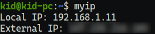

# myip
A tiny utility for extracting your local &amp; external IP address.

## Usage
Download the latest release of **myip** for your OS from the [releases](https://github.com/Kid0h/myip/releases/latest) page, or build from source ([instructions below](#building-from-source)).

Simply run the binary and you'll get the information you need.




## Building from source
You'll need to have [rust](https://www.rust-lang.org/tools/install) installed, the rest of the dependencies are automatically downloaded and compiled by cargo (rust's package manager).
```
git clone https://github.com/Kid0h/myip
cd myip
cargo build --release
```
The binary will be at `target/release/myip`

## Reaching out
If you have any issues, suggestions or questions feel free to open an issue with the appropriate tag [here](https://github.com/Kid0h/MCSnatcher/issues/new)!
